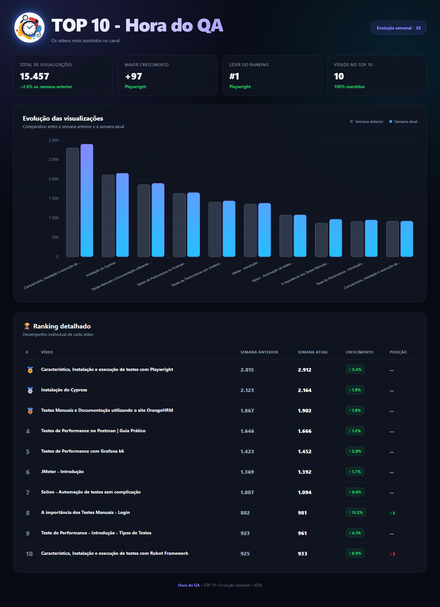

# 🏆 TOP 10 — Hora do QA

Os vídeos mais acessados no canal

<div align="center">

</div>
 Dashboard visual para acompanhar a evolução semanal dos **10 vídeos mais assistidos do canal Hora do QA**.

 O projeto apresenta um comparativo entre a **semana anterior** e a **semana atual**, permitindo visualizar de forma rápida quais vídeos cresceram, como o ranking se comportou e qual foi a evolução geral das visualizações.

---

 ## 📊 Preview

 O dashboard possui uma interface moderna em **Dark Mode**, utilizando uma combinação de tons roxo e ciano para destacar os dados.

 Principais elementos:

- 🏆 Ranking dos 10 vídeos mais assistidos
- 📈 Gráfico comparativo entre duas semanas
- 👀 Visualizações da semana anterior
- 🚀 Visualizações da semana atual
- 📊 Percentual de crescimento de cada vídeo
- 🔄 Mudança de posição no ranking
- 🥇 Destaque para os três primeiros colocados
- 📌 Resumo geral do desempenho
- 🔗 Links diretos para os vídeos no YouTube
- 📱 Layout responsivo para desktop, tablet e celular

---

 ## 🎯 Objetivo

 O objetivo do projeto é transformar os dados semanais do canal **Hora do QA** em uma apresentação visual simples e agradável.

 A ideia é que, toda semana, seja possível atualizar os números e rapidamente visualizar:

 > **O que cresceu? O que caiu? Qual vídeo está performando melhor?**

 Além de facilitar a análise, o dashboard pode ser utilizado como uma apresentação visual para acompanhar a evolução do canal ao longo do tempo.

---

 ## ✨ Funcionalidades

 ### 📈 Comparativo semanal

 O gráfico apresenta duas barras para cada vídeo:

- **Semana anterior** — representada em cinza
- **Semana atual** — representada com gradiente roxo/ciano

 Isso permite identificar rapidamente a evolução de cada conteúdo.

 ### 🚀 Crescimento percentual

 O sistema calcula automaticamente o crescimento de cada vídeo:

```
Crescimento =
((Visualizações atuais - Visualizações anteriores)
 / Visualizações anteriores) × 100
```

 Por exemplo:

```
Semana anterior: 2.815
Semana atual:    2.912

Crescimento: +3,4%
```

 ### 🏆 Evolução do ranking

 O dashboard também compara a posição de cada vídeo.

 Exemplo:

```
#10 → #8  ↑ 2
```

 ou

```
#8 → #10  ↓ 2
```

 Quando o vídeo mantém a posição:

```
#5 → #5  —
```

---

 ## 🛠️ Tecnologias utilizadas

 O projeto foi desenvolvido utilizando tecnologias simples e sem necessidade de backend.

 ### HTML5

 Responsável pela estrutura da página.

 ### CSS3

 Utilizado para:

- Layout
- Responsividade
- Dark Mode
- Gradientes
- Cards
- Bordas
- Sombras
- Efeitos visuais

 ### JavaScript

 Responsável por:

- Processar os dados
- Calcular crescimento
- Calcular mudança de posição
- Gerar o ranking
- Atualizar os indicadores
- Alimentar o gráfico

 ### Chart.js

 Utilizado para criação do gráfico de barras.

 A biblioteca é carregada diretamente através de CDN:

```
<script src="https://cdn.jsdelivr.net/npm/chart.js"></script>
```

---

 ## 📁 Estrutura do projeto

 Uma estrutura simples pode ser utilizada:

```
top-10/
│
├── index.html
├── logo-hora-do-qa.png
└── README.md
```

 ### `index.html`

 Arquivo principal da aplicação.

 Contém:

- HTML
- CSS
- JavaScript
- Dados do TOP 10
- Configuração do gráfico

 ### `logo-hora-do-qa.png`

 Logo utilizada no cabeçalho do dashboard.

---

 ## 🚀 Como executar

 Não é necessário instalar dependências ou configurar um servidor.

 Basta clonar ou baixar o projeto:

```
git clone <URL_DO_REPOSITORIO>
```

 Entrar na pasta:

```
cd top-10-hora-do-qa
```

 E abrir o arquivo:

```
index.html
```

 no navegador.

 Também é possível utilizar uma extensão como **Live Server** no VS Code para executar o projeto localmente.

---

 ## ✏️ Como atualizar os dados

 Os dados das semanas ficam armazenados no JavaScript dentro do arquivo `index.html`.

 Procure pelo array:

```
const videos = [
    {
        rankPrevious: 1,
        rankCurrent: 1,
        previous: 2815,
        current: 2912,
        title: "Característica, Instalação e execução de testes com Playwright",
        url: "https://www.youtube.com/watch?v=qSYWRtROGE4&t"
    }
];
```

 Para adicionar uma nova semana, basta atualizar:

```
rankPrevious
```

 posição do vídeo na semana anterior.

```
rankCurrent
```

 posição do vídeo na semana atual.

```
previous
```

 número de visualizações da semana anterior.

```
current
```

 número de visualizações da semana atual.

```
title
```

 nome do vídeo.

```
url
```

 link do vídeo no YouTube.

---

 ## 🖼️ Personalizando a logo

 A logo pode ser adicionada ao projeto utilizando:

```

```

 Como a logo possui formato circular, o CSS pode utilizar:

```
.logo {
    width: 100px;
    height: 100px;
    border-radius: 50%;

    display: flex;
    align-items: center;
    justify-content: center;

    overflow: hidden;

    box-shadow:
        0 0 0 3px rgba(108, 99, 255, 0.15),
        0 0 20px rgba(108, 99, 255, 0.45),
        0 0 50px rgba(0, 212, 255, 0.25);
}
```

 Para logos PNG com fundo transparente, também é possível utilizar `drop-shadow()` para criar um brilho seguindo o formato da própria imagem.

---

 ## 🎨 Identidade visual

 O projeto utiliza uma paleta baseada principalmente em:

 | Cor | Utilização |
| --- | --- |
| `#080b14` | Fundo |
| `#101522` | Cards |
| `#6c63ff` | Roxo principal |
| `#8b85ff` | Roxo claro |
| `#00d4ff` | Ciano |
| `#22c55e` | Crescimento |
| `#ef4444` | Queda |
| `#facc15` | Destaques / pódio |

 O objetivo é criar uma identidade visual tecnológica e alinhada ao universo de **QA, testes e automação**.

---

 ## 📱 Responsividade

 O dashboard foi desenvolvido para funcionar em diferentes tamanhos de tela:

- 💻 Desktop
- 💻 Notebook
- 📱 Smartphone
- 📲 Tablet

 Em telas menores, o ranking pode ser rolado horizontalmente para preservar todas as informações.

---

 ## 🔮 Próximas melhorias

 Algumas funcionalidades podem ser adicionadas futuramente:

- [ ] Histórico de várias semanas
- [ ] Gráfico de evolução ao longo do tempo
- [ ] Filtro por período
- [ ] Dashboard com dados reais do YouTube
- [ ] Integração com YouTube Data API
- [ ] Atualização automática dos dados
- [ ] Exportação do ranking para PNG
- [ ] Compartilhamento do TOP 10
- [ ] Indicador de maior crescimento
- [ ] Histórico de entrada e saída do TOP 10
- [ ] Página dedicada para cada vídeo
- [ ] Comparação mensal
- [ ] Ranking histórico dos vídeos
- [ ] Persistência dos dados em JSON

---

 ## 💡 Ideia para evolução do projeto

 Uma evolução natural seria transformar o dashboard em um sistema de acompanhamento histórico.

 Em vez de comparar somente:

```
Semana anterior
        ×
Semana atual
```

 seria possível armazenar:

```
Semana 01
Semana 02
Semana 03
Semana 04
Semana 05
...
```

 E então criar gráficos como:

```
Visualizações
     │
3000 │                 ●
     │             ●───┘
2500 │         ●───┘
     │     ●───┘
2000 │ ●───┘
     └────────────────────
       S1  S2  S3  S4  S5
```

 Dessa forma, o **TOP 10** deixaria de ser apenas um comparativo semanal e se transformaria em um verdadeiro **dashboard de crescimento do canal Hora do QA**.

---

 ## 👨‍💻 Projeto

 Projeto criado para acompanhamento visual do desempenho dos vídeos do canal:

 **Hora do QA**

 Focado em conteúdos relacionados a:

 - Quality Assurance
- Testes de Software
- Automação de Testes
- Testes de Performance
- Playwright
- Cypress
- Robot Framework
- JMeter
- Grafana k6
- Postman
- Testes Manuais

---

 ## 📄 Licença

 Este projeto pode ser utilizado e adaptado conforme a necessidade do canal.

 Os conteúdos, vídeos e identidade visual pertencentes ao **Hora do QA** permanecem de propriedade de seus respectivos autores.
